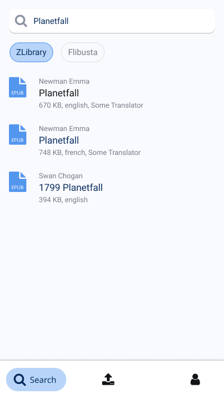
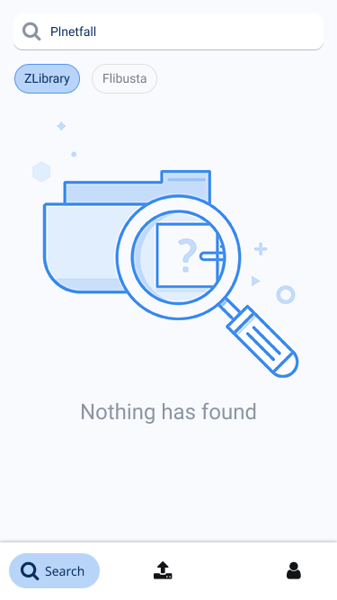
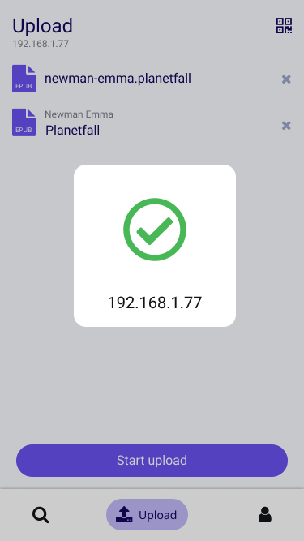
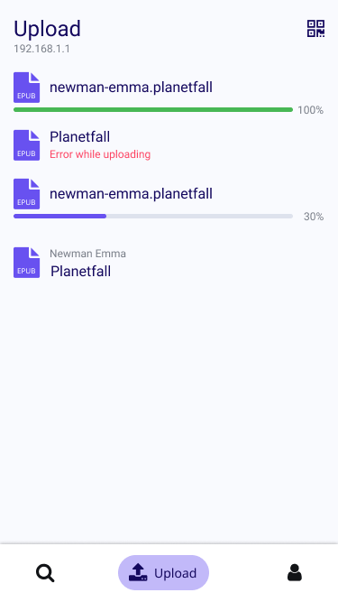
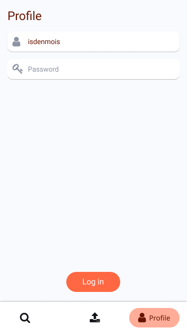

# Table of contents

- [Search screen](#search-screen)
- [Upload screen](#upload-screen)
- [Profile screen](#profile-screen)

## Search screen

When the application is opened it starts with a search screen:

You can search and find some awesome free books:

But sometimes you'll found nothing:

## Upload screen

After that, you can upload books to your device:

You have to scan a QR code to update the IP address:

If the address is correct, you can start the upload process:

## Profile screen

That screen is used for auth in litres service:

